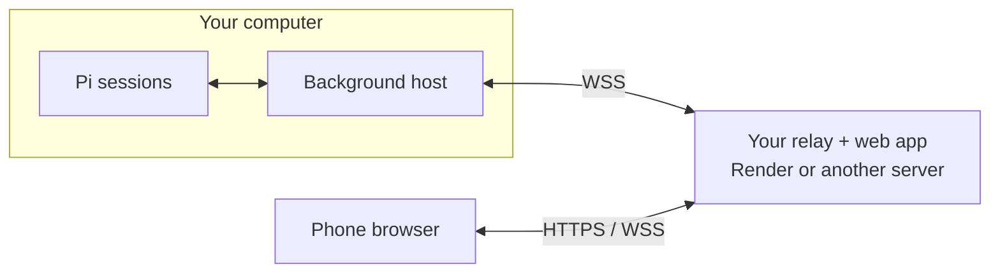

# Pi Remote

Control Pi coding-agent sessions from your phone. Browse conversations, send prompts, and switch sessions while others keep working.

Self-hosted only: deploy your own relay, enter its HTTPS address once, and scan the QR.



Your computer makes an outbound connection; no inbound port is needed. Pi and model credentials stay on your computer. Traffic between your phone and computer is end-to-end encrypted: the relay forwards ciphertext and cannot read conversations or send commands. It still delivers the web app's page code from your computer to your phone, so a tampered relay deployment could ship modified page code. Deploy only from a repository you trust.

## Get started

Requires Node.js 22.19+, Git, a working Pi installation on macOS/Linux, and a Render account.

### 1. Install

```sh
pi install git:github.com/peterlimg/pi-remote
```

Pi downloads the package and installs its dependencies. No manual clone, fork, or `npm install` is needed. Start Pi, or run `/reload` in an existing terminal.

### 2. Deploy from `/pi-remote`

On first run, `/pi-remote` walks you through five short steps, one per screen. Enter does each step's action.

1. Press Enter to create a free [Render account](https://dashboard.render.com/register), or **S** to skip if you have one. Sign up first: Render's sign-up does not return you to the deploy page.
2. Press Enter to open the [Deploy to Render page](https://render.com/deploy?repo=https://github.com/peterlimg/pi-remote/tree/main). It uses this repository's `main` branch directly.
3. Press **C** to copy the host token, and paste it into Render's `PI_REMOTE_RELAY_HOST_TOKEN` field.
4. Press **C** to copy the client token, and paste it into `PI_REMOTE_RELAY_CLIENT_TOKEN`. Do not paste either token into chat.
5. Click **Deploy** and wait for the service to be **Live**. Return to Pi, paste your service's `https://…onrender.com` address into the same screen, and press Enter.

Render's Free plan is enough, and no GitHub connection is needed because this repository is public. The relay runs in your Render account, not a shared service. Keep one instance per computer; it supports up to 16 browser connections and needs no database. The Free plan can sleep and take about a minute to wake.

### 3. Scan the QR

Pi starts the background host and checks the relay's phone-login path before showing the QR. Scan it to open the mobile web app and log in. If the check fails, Pi explains what to fix instead of showing an unusable QR. Escape cancels the check; run `/pi-remote` to retry.

### Another server

Render is optional. Get your tokens from `/pi-remote setup`, then deploy this repository on a server with Node.js 22.19+ using `npm ci --omit=dev --ignore-scripts`. Configure these variables privately in your process manager:

```text
PI_REMOTE_RELAY_HOST_TOKEN=<host token from your Pi computer>
PI_REMOTE_RELAY_CLIENT_TOKEN=<client token from your Pi computer>
PI_REMOTE_PUBLIC_URL=https://remote.example.com
```

Run `node bin/pi-remote.mjs relay` from the repository directory, with automatic restart enabled. It listens on `127.0.0.1:8788`. Point your domain at the server and proxy HTTPS/WebSockets to that port. For Caddy:

```caddyfile
remote.example.com {
    reverse_proxy 127.0.0.1:8788
}
```

Allow ports 80 and 443 for Caddy; keep 8788 private. When the server is ready, continue the Pi setup screen with its HTTPS address.

## Daily use

The relay address is saved in `~/.pi/remote/config.json`. Future `/pi-remote` runs skip deployment instructions, check connectivity, and show the QR.

Keep your computer awake and the relay running. The background host survives closing the terminal. You can add the web app to your phone's home screen.

| Command in Pi | Action |
|---|---|
| `/pi-remote` | Start or reuse the host and show the QR |
| `/pi-remote status` | Check host and relay connectivity |
| `/pi-remote stop` | Stop remote access, not terminal agents |
| `/pi-remote restart` | Restart the host after code changes and show the QR |
| `/pi-remote setup` | Change the relay address after stopping the host |

Select a session to send prompts; switching sessions does not stop their work. Type `/` for that session's extension commands, templates, and skills. `/new` starts a separate session in the same project and opens it on your phone; the original session keeps running. Use `/model` to choose from the session's available models, or `/model provider/model-id` to switch directly. This changes only that session, not the default for new sessions. Other built-in menus such as `/settings` still require the computer. If a send loses its acknowledgement, inspect the conversation before retrying; uncertain commands are not replayed automatically.

## Security and troubleshooting

- The QR is a reusable login link granting access to all exposed sessions. It carries the login token and an encryption key; the key stays in the link fragment and never reaches the relay. Keep it private and use trusted browsers. Login persists until you sign out or clear browser data.
- Phones signed in before end-to-end encryption must scan the QR again.
- To revoke phone access, stop the host and relay, replace `clientToken` in `~/.pi/remote/config.json` with a fresh 32-byte random secret, update `PI_REMOTE_RELAY_CLIENT_TOKEN` on the relay, and restart both. This also rotates the encryption key. There is no per-device revocation.
- If connection fails, check `/pi-remote status` and `~/.pi/remote/host.log`. Run `/pi-remote stop`, then `/pi-remote setup` to see your tokens and correct the address. `/health` checks only the relay, not the computer connection.
- The configured HTTPS address must match the one your phone uses. For a Render custom domain, update the start command's `PI_REMOTE_PUBLIC_URL` and run `/pi-remote setup`. Environment overrides take precedence over saved settings.

## Update

Run `pi update git:github.com/peterlimg/pi-remote`. Stop remote access with `/pi-remote stop`, exit and restart all Pi terminals, resume your sessions, and run `/pi-remote`. Refresh the phone page. `/reload` alone does not refresh cached shared modules after code changes.

Your relay serves the phone app from your computer, so app updates need no relay redeploy. Render does not redeploy a relay created from this public repository on its own. When `/pi-remote` says your relay runs an older version, open the service in Render and choose **Manual Deploy > Deploy latest commit**. On your own server, pull and restart the relay.

## Development checks

```sh
npm run check
npm test
npx playwright install chromium
npm run test:browser
```
