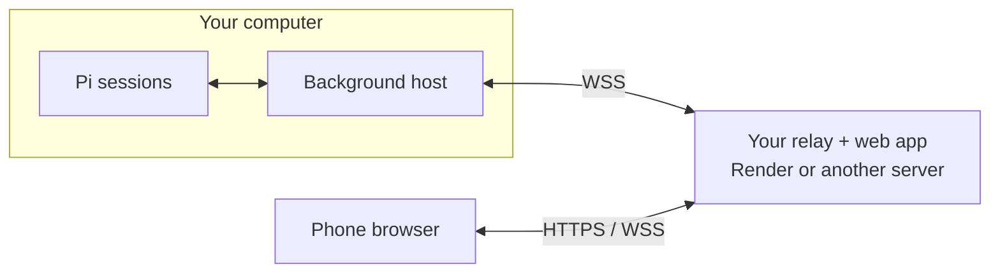

# Pi Remote

Control Pi coding-agent sessions from your phone. Browse conversations, send prompts, and switch sessions while others keep working.

Self-hosted only: deploy your own relay, enter its HTTPS address once, and scan the QR.



Your computer makes an outbound connection; no inbound port is needed. Pi and model credentials stay on your computer. The relay can read conversation traffic; there is no end-to-end encryption.

## Install

Requires Node.js 22.19+ and a working Pi installation on macOS/Linux.

```sh
git clone --branch main https://github.com/peterlimg/pi-remote.git
cd pi-remote
npm ci --ignore-scripts
pi install .
node bin/pi-remote.mjs relay-env
```

The last command prints two credentials from this computer's configuration. Copy them privately to your relay during deployment. Do not commit them or generate different values on the server.

## Deploy your relay

Use one relay instance per computer, supporting up to 16 browser connections. No database is needed.

### Render

1. Fork this repository and enable GitHub Actions on your fork.
2. In [Render](https://dashboard.render.com/), choose **New > Blueprint**, connect your fork, and select `main`.
3. Use the included [`render.yaml`](render.yaml). Enter the two values printed by `relay-env`:
   - `PI_REMOTE_RELAY_HOST_TOKEN`
   - `PI_REMOTE_RELAY_CLIENT_TOKEN`
4. Deploy. The blueprint configures the build, port, and HTTPS address automatically.
5. Copy your service's HTTPS address and check it:

   ```sh
   curl --fail https://YOUR-SERVICE.onrender.com/health
   # Expected: ok
   ```

Render deploys updates after CI passes. The Free plan can sleep after 15 minutes of inactivity and take about a minute to wake; use a paid instance to avoid this.

### Another server

On a server with Node.js 22.19+, clone this repository and run `npm ci --omit=dev --ignore-scripts`. Configure these variables privately in your process manager:

```text
PI_REMOTE_RELAY_HOST_TOKEN=<host token from your Pi computer>
PI_REMOTE_RELAY_CLIENT_TOKEN=<client token from your Pi computer>
PI_REMOTE_PUBLIC_URL=https://remote.example.com
```

Run `node bin/pi-remote.mjs relay` from the repository directory, with automatic restart enabled. It listens on `127.0.0.1:8788`. Point your domain at the server and proxy HTTPS/WebSockets to that port. For Caddy:

```caddyfile
remote.example.com {
    reverse_proxy 127.0.0.1:8788
}
```

Allow ports 80 and 443 for Caddy; keep 8788 private. Verify `/health` as above.

## Connect your phone

In Pi, run `/reload` after first installation, then `/pi-remote`. Enter your relay's HTTPS address, confirm the credentials are configured, and scan the QR. The address is saved in `~/.pi/remote/config.json`; future runs go straight to the QR.

Keep your computer awake and the relay running. The background host survives closing the terminal. You can add the web app to your phone's home screen.

| Command in Pi | Action |
|---|---|
| `/pi-remote` | Start or reuse the host and show the QR |
| `/pi-remote status` | Check host and relay connectivity |
| `/pi-remote stop` | Stop remote access, not terminal agents |
| `/pi-remote setup` | Change the relay address after stopping the host |

Select a session to send prompts; switching sessions does not stop their work. Type `/` for that session's extension commands, templates, and skills. Built-in terminal menus such as `/model` and `/settings` still require the computer. If a send loses its acknowledgement, inspect the conversation before retrying; uncertain commands are not replayed automatically.

## Security and troubleshooting

- The QR is a reusable login link granting access to all exposed sessions. Keep it private and use trusted browsers. Login persists until you sign out or clear browser data.
- To revoke phone access, stop the host and relay, replace `clientToken` in `~/.pi/remote/config.json` with a fresh 32-byte random secret, update `PI_REMOTE_RELAY_CLIENT_TOKEN` on the relay, and restart both. There is no per-device revocation.
- If connection fails, check `/pi-remote status` and `~/.pi/remote/host.log`. Verify the relay's tokens match `relay-env` on your computer. `/health` checks only the relay, not the computer connection.
- The configured HTTPS address must match the one your phone uses. For a Render custom domain, update the start command's `PI_REMOTE_PUBLIC_URL` and run `/pi-remote setup`. Environment overrides take precedence over saved settings.

## Update

Update both the relay repository and your local checkout. On your computer, run `npm ci --ignore-scripts`, then `/pi-remote stop` in Pi. Exit and restart all Pi terminals, resume your sessions, and run `/pi-remote`. Refresh the phone page. `/reload` alone does not refresh cached shared modules after code changes.

## Development checks

```sh
npm run check
npm test
npx playwright install chromium
npm run test:browser
```
