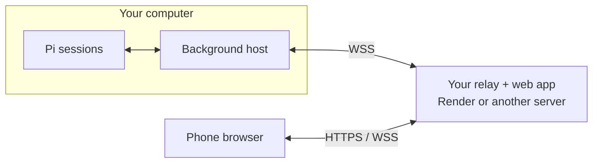

# Pi Remote

Control Pi coding-agent sessions from a mobile browser. Open one session while the others keep working.

Pi Remote is self-hosted. Deploy your own relay, enter its HTTPS address once, then scan the QR from `/pi-remote`. No shared hosted relay is provided. Development and Render deployments use the `main` branch.

## How it connects



Your computer initiates the relay connection; no inbound port is needed. Pi and model credentials stay on your computer. Prompts, conversation text and tool output pass through your relay, which can read them.

## What it does

- Lists live sessions across Pi terminals and saved sessions across project directories.
- Streams Markdown conversation and compact tool updates. Tool rows show file paths with line ranges or shell commands; shell output previews the last five available lines. Expand a row for full inputs and available output. Raw HTML and remote images are disabled.
- Sends prompts, steering messages and follow-ups to the selected live session.
- Shows the selected session's extension commands, prompt templates and skills when you type `/`.
- Keeps independent message drafts while navigating between sessions.
- Browses saved session history and optionally resumes a session in a Pi RPC worker.
- Handles standard confirmation/input/selection dialogs from RPC workers.
- Reconnects automatically and fetches a fresh snapshot. Connection attempts time out after 20 seconds. Browser heartbeats detect silent connections, and returning to the app or coming back online starts a fresh connection. Uncertain commands are never automatically replayed.
- Connects to your own relay through an outbound computer connection. No inbound port is needed on your computer.

## Quick start on your computer

Requires Node.js 22.19+ and a working Pi installation with your existing model credentials.

```sh
git clone --branch main https://github.com/peterlimg/pi-remote.git
cd pi-remote
npm install
pi install .
```

Deploy your relay using the [Render instructions](#deploy-your-relay-on-render) below, or [another server](#deploy-your-relay-on-another-server). Generate the relay credentials on the computer where you installed Pi Remote, not on the relay server.

In an existing Pi terminal, run `/reload` once. Then:

```text
/pi-remote
```

On first use, enter your relay's public HTTPS address and confirm that you configured its credentials. Pi remembers the address in `~/.pi/remote/config.json`. There is no transport chooser or default hosted server. Subsequent runs go straight to the QR.

Pi starts the shared host in the background and shows a private login QR. Scan it with your phone camera. Press Escape to hide the QR and keep working. Run `/pi-remote` again to show it, or `/pi-remote stop` to stop remote access across all terminals.

The host survives `/reload`, session changes and closing the terminal that started it. Terminal agents keep running when you stop remote access; saved-session RPC workers stop. The relay must stay running and the computer must stay awake.

`/pi-remote status` checks the host and relay connection. `/pi-remote setup` changes the saved address after stopping the host. A sleeping Render relay may need about a minute to connect. A localhost-only link is never shown as a phone QR.

The QR is generated locally and shown only in a temporary terminal screen, not saved in the conversation or sent to the model. Enlarge a small terminal if the QR doesn't fit; the private link remains available. This is a reusable shared login link, not a one-time pairing code.

**Upgrading from the manual host:** stop the old `serve` process with Ctrl+C once, install dependencies with `npm install`, then exit and restart Pi and resume your session. Old hosts don't have the new authenticated start/stop control endpoint. `/reload` alone does not refresh shared `.mjs` modules already cached by Node.

For optional shell commands, run `npm link`, or use `node bin/pi-remote.mjs` instead of `pi-remote`.

The extension registers on session start, including sessions whose file has not been flushed to disk yet. Completely ephemeral `--no-session` sessions are not exposed.

## Deploy your relay on Render

The included `render.yaml` runs only the relay and mobile web app in your Render account. Pi, model credentials, session files and RPC workers stay on your computer. No database or persistent disk is needed. One relay supports **one computer and up to 16 simultaneous browser connections**, with any number of Pi sessions on that computer.

### 1. Generate credentials on your computer

From the Pi Remote repository on the computer running Pi:

```sh
node bin/pi-remote.mjs relay-env
```

This prints `PI_REMOTE_RELAY_HOST_TOKEN` and `PI_REMOTE_RELAY_CLIENT_TOKEN` from your local configuration. Keep both values private. Do not generate different secrets on Render, commit them, or paste them into a conversation.

### 2. Create your Render service

1. Fork `peterlimg/pi-remote` into your GitHub account if you want to control when updates deploy. Enable GitHub Actions on your fork so the deployment checks can run.
2. In the [Render dashboard](https://dashboard.render.com/), select **New > Blueprint**, connect your repository, and choose branch `main`.
3. Use the included `render.yaml`. When prompted, enter the matching values from step 1:

   | Render environment variable | Value |
   |---|---|
   | `PI_REMOTE_RELAY_HOST_TOKEN` | The printed host token |
   | `PI_REMOTE_RELAY_CLIENT_TOKEN` | The printed client token |

4. Deploy. The blueprint installs dependencies, runs the relay, and configures its port, bind address and public HTTPS URL automatically. You do not need to enter those settings.
5. Keep exactly one service instance because host/client routing lives in memory.

The blueprint uses the Free plan. Free services can sleep after 15 minutes without inbound traffic and take about a minute to wake. Choose a paid instance to avoid idle spin-down.

### 3. Connect your phone

Copy your service's actual `https://…onrender.com` address from Render and check it:

```sh
curl --fail https://YOUR-SERVICE.onrender.com/health
# Expected: ok
```

In Pi, run `/pi-remote`, enter that HTTPS address, and confirm you configured the credentials. The WSS address is saved automatically. Scan the QR, check that sessions appear, and send a test prompt. You can add the web app to your phone's home screen.

If changing an existing address, run `/pi-remote stop` followed by `/pi-remote setup`. `/pi-remote status` reports whether the computer has authenticated with the relay; `/health` confirms only that the relay is running. If the computer cannot authenticate, check that Render's two token values match `relay-env` on this computer.

The relay can read transmitted content. This version does **not** implement end-to-end encryption. QR login uses the computer's shared client token, not a one-time code.

### Updates and custom domains

Push or sync updates to the linked `main` branch. Render deploys automatically after CI passes. Then update the local checkout and run `npm ci --ignore-scripts`, `/pi-remote stop`, exit and restart Pi, resume your session, and run `/pi-remote`. Refresh the phone page. Restart other Pi terminals too; `/reload` does not refresh cached shared modules. Deploys disconnect sockets; clients reconnect without replaying uncertain commands.

Render terminates TLS and forwards WebSockets. The start command maps Render's `PORT` and `RENDER_EXTERNAL_URL` to the relay settings. To use a custom domain, configure it in Render, change the start command's `PI_REMOTE_PUBLIC_URL` to that exact HTTPS origin, and update the address with `/pi-remote setup`. Changing origins requires scanning the QR again.

## Deploy your relay on another server

Render is optional. Use a server with Node.js 22.19+, a domain pointing to it, and an HTTPS reverse proxy with WebSocket support.

1. Generate the two credentials **on your Pi computer** using `node bin/pi-remote.mjs relay-env` as above.
2. On the server, clone your repository and install production dependencies:

   ```sh
   git clone --branch main https://github.com/YOUR-ACCOUNT/pi-remote.git
   cd pi-remote
   npm ci --omit=dev --ignore-scripts
   ```

3. Configure these environment variables privately in your process manager, such as systemd. Start `node bin/pi-remote.mjs relay` from the repository directory and configure it to restart after failures and server reboots.

   ```text
   PI_REMOTE_RELAY_HOST_TOKEN=<host token from your computer>
   PI_REMOTE_RELAY_CLIENT_TOKEN=<client token from your computer>
   PI_REMOTE_PUBLIC_URL=https://remote.example.com
   ```

4. The relay listens on `127.0.0.1:8788`. For a Caddy proxy on the same server, use:

   ```caddyfile
   remote.example.com {
       reverse_proxy 127.0.0.1:8788
   }
   ```

   Allow inbound ports 80 and 443 for Caddy's HTTPS setup. Keep port 8788 private. Caddy forwards WebSockets automatically.

5. Check `https://remote.example.com/health`, then run `/pi-remote` on your computer, enter `https://remote.example.com`, confirm the credentials, and scan the QR. Keep one relay instance.

### Advanced: existing HTTPS tunnels

Existing tunnel configurations still work, but tunnels are not an onboarding option. If you already operate an HTTPS tunnel to `127.0.0.1:8787`, stop Pi Remote and set these variables before starting Pi:

```sh
export PI_REMOTE_PUBLIC_URL=https://your-tunnel.example
export PI_REMOTE_RELAY_URL=''
```

Run `/pi-remote` to show the QR. Environment overrides take precedence over saved configuration; unset them and restart Pi before using `/pi-remote setup` for a relay.

## Navigating sessions

Selecting a session changes only the browser subscription. It never sends `/resume` to another terminal or stops another session's work.

Send uses Pi's default behavior: start a message when idle or steer while working, without a mode selector. On desktop, Enter sends, Shift+Enter inserts a newline, and Alt+Enter queues a follow-up. On touch devices, Enter inserts a newline; use Send to submit. Expand a tool row to inspect its input and output. Project paths are under Details, and scan warnings are under the connection status in the session list.

Type `/` at the start of the composer to see commands from the selected Pi session. Keep typing to filter, use Up/Down to select, Tab to complete, Enter to run, or Escape to dismiss. On touch devices, tap a command to insert it, add any arguments, then tap Send. Pi handles extension commands and expands templates and `/skill:name` prompts, including while working.

This is not full terminal-command parity. Pi's remote prompt APIs do not execute built-in interactive commands such as `/model`, `/settings`, `/compact` or `/new`. They are excluded from the menu and rejected on submission instead of being sent to the model. Argument autocomplete and custom terminal dialogs still require the terminal. Commands that open terminal dialogs may need input on your computer; standard RPC worker dialogs can be answered here. Command discovery requires Pi's `getCommands` API. After updating, restart the host and Pi terminals and refresh the browser.

| Status | Meaning |
|---|---|
| working | Pi is running |
| waiting | Pi needs input |
| idle | Connected and ready for another instruction |
| saved | History is on disk; a worker can be started if enabled |
| disconnected | A terminal connection was lost or remote access was disabled |
| starting | A saved-session worker is starting |

Saved history follows the last persisted branch. A live extension reports Pi's actual current branch. Mobile history is limited to the latest 100 messages; each message is limited to 24,000 characters, and tool output to 12,000 characters. The UI marks shortened history/output.

### Saved-session resume and ownership

After loading the extension in **every** running Pi instance, start the service with:

```sh
pi-remote serve --allow-resume
```

The Resume button can then start a saved session in its original project directory. A currently connected session attaches to its existing process.

Locks are cooperative: Pi processes without this extension do not participate. Do not open the same saved file in an uninstrumented Pi process while the service manages it. Enabling resume is a local assertion that this condition is met.

- Each terminal and each RPC worker owns an exclusive session lock.
- A disconnected terminal keeps its lock. Lost heartbeats never authorize takeover.
- Normal shutdown releases ownership.
- After a crash, recovery is explicit:
```sh
pi-remote unlock /absolute/path/to/session.jsonl
# If the service itself crashed:
pi-remote unlock service
```

Recovery refuses while the recorded owner or RPC worker PID still exists. If an RPC spawn crashed before its worker PID was recorded, inspect processes locally before manually repairing the lock; automatic takeover stays blocked.

### Terminal controls

- `/pi-remote` or `/pi-remote start`: start or reuse the shared background host and show the login QR.
- `/pi-remote stop`: stop the shared host and its RPC workers, not terminal agents.
- `/pi-remote status`: show host and relay connection status without revealing credentials.
- `/pi-remote setup`: save a relay/tunnel address. Stop the host first.
- `/remote`: alias for `/pi-remote`.
- `/remote off`: disable this terminal's remote channel while retaining its ownership lock.
- `/remote on`: reconnect.
- `/reload`: discover the extension after first installation. After code updates, exit and restart Pi to refresh its shared modules.

**Abort turn differs by runtime:** RPC workers clear queued messages and abort. The terminal extension can only invoke Pi's exposed `ctx.abort()`; queued messages may still run. It does not pretend to provide “stop everything.”

Arbitrary terminal dialogs from other extensions cannot be answered from the phone. Standard RPC worker dialogs can. Expired dialog responses remain subject to Pi's own timeout handling.

## Configuration

| Variable | Default / purpose |
|---|---|
| `PI_REMOTE_HOME` | `~/.pi/remote`; use the same value in Pi terminals and the service |
| `PI_REMOTE_PORT` | Local service port, default 8787; same value in the service and extensions |
| `PI_REMOTE_SESSION_DIRS` | Session roots, separated by `:` on macOS/Linux (`;` on Windows); default `~/.pi/agent/sessions` |
| `PI_REMOTE_PI_BIN` | Pi executable for RPC workers, default `pi` |
| `PI_REMOTE_PUBLIC_URL` | Overrides saved `publicUrl`; exact public HTTPS origin for browser origin checks and pairing links |
| `PI_REMOTE_RELAY_URL` | Overrides saved `relayUrl`; optional outbound WSS relay URL. Set empty to disable it |
| `PI_REMOTE_RELAY_PORT` | Relay port, default 8788 |
| `PI_REMOTE_RELAY_BIND` | Relay bind address, default 127.0.0.1 |

`/pi-remote setup` saves `publicUrl` and `relayUrl` without changing credentials. Environment variables take precedence; unset them and restart Pi to use interactive setup. Background host diagnostics go to `~/.pi/remote/host.log` with owner-only permissions. Logs are not automatically rotated. Shell equivalents are `pi-remote start`, `pi-remote stop`, `pi-remote status`, and `pi-remote pair`. `serve` still runs in the foreground and supports `--allow-resume`.

Keep API/model credentials in your existing Pi configuration. They are not sent to the relay. Conversation/tool text can of course contain secrets, so treat the relay and paired browsers as trusted.

## Access and persistence

The private pairing link grants access to all exposed sessions. Its token is taken from the URL fragment, removed from browser history, and stored in localStorage so login survives closing and reopening the app. Existing sessionStorage logins migrate on the next page load. Only sign in on a trusted device. This version has a shared client token, not individual device identities. Sign out clears the saved token and signs out other open tabs for the same origin, clearing their in-memory drafts. Clearing browser data, using private browsing or switching browsers/origins can require scanning the QR again. Authentication delivery timeouts retry without clearing the token; rejected credentials still sign you out.

To revoke all phone access, stop the host/relay, replace `clientToken` in `~/.pi/remote/config.json` with a fresh 32-byte random value, update the relay client token if used, and restart. Rotate `relayToken` separately if the relay host credential was exposed.

Command journals are stored in `~/.pi/remote/commands` and `extension-commands`. They contain prompt text and results, protected by local directory/file permissions. They are not automatically pruned in this version. A request ID is never reused with different content. Interrupted requests remain unknown and require inspection rather than automatic replay.

## Verification

```sh
npm run check
npm test
npx playwright install chromium
npm run test:browser
```

CI checks Node 22 and 24, concurrent background starts and stop/restart, authenticated host controls, saved setup, QR decoding and narrow-terminal fallback, session ownership, restart deduplication, Unicode-safe RPC framing, the actual extension with a mocked Pi API, real WebSocket routing, saved RPC workers with a fake Pi process, relay connections, and mobile browser navigation. A separate smoke job loads the extension in Pi 0.85.1 and exercises registration and remote on/off without a model call.

For an upgrade check, load the old extension in Pi, update the files, and run `/reload` followed by `/pi-remote`. An error such as `publicOrigin is not a function` means Node still holds the old `.mjs` exports. Exit Pi, restart and resume the session, then run `/pi-remote` again. Fresh-process tests do not cover this mixed-version state.

Browser tests check that composer drags do not move the page, conversation and multiline-input scrolling still work, and visual viewport resize/scroll events keep the composer visible. Desktop automation does not open a real iOS keyboard. On an iPhone, send a message, dismiss the keyboard, then swipe up and down starting from the composer buttons. The page must stay fixed while swipes inside the conversation still scroll its history. Repeat with the keyboard open and after rotating the phone.

Authentication tests cover QR/manual login persistence after reopening a tab, migration of existing logins, cross-tab sign out, rejected credentials, and recovery from the real server's authentication deadline. Reconnect tests simulate stalled WebSocket handshakes, missing authentication acknowledgements, silent connections, network/foreground recovery, and late events from replaced sockets. They check that drafts survive, the selected session is watched again, and uncertain commands are not replayed. On a real phone, disconnect Wi-Fi or lock the screen, restore connectivity, and return to the app. The session and draft should recover without another Send action.

Slash-command tests cover live discovery, session isolation, filtering, touch and keyboard selection, failed discovery, IME input, and command expansion options. The real Pi smoke test discovers and runs `/pi-remote status` through the remote bridge without a model call.

A real model/tool smoke test on your Mac is still needed. CI does not validate your provider credentials, your other extensions, Safari-specific behaviour, your tunnel or a deployed relay.

## Scope of this version

- macOS/Linux host use is the primary target; no automatic launch-at-login installer.
- One computer per relay; no accounts or multi-user permissions.
- Shared revocable tokens; no one-time pairing codes or per-device revocation.
- No push notifications, image uploads, syntax highlighting or dedicated diff viewer.
- No remote creation of brand-new sessions; start one in Pi, then control it from mobile.
- Session browsing uses Pi's JSONL format; the full Pi session tree remains available in the terminal.
- Sessions larger than 32 MiB are excluded from saved browsing; scans cap at 5,000 files.
- The UI is a mobile web app with a home-screen manifest. It has no offline worker or native iOS app.
